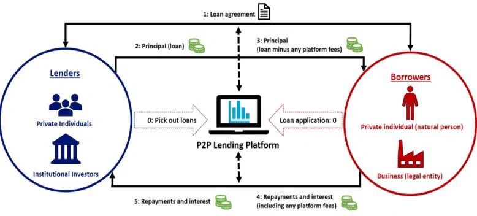

# Credit Risk Modelling
---
Credit Risk Modeling is a technique used by lenders to determine the level of credit risk associated with extending credit to a borrower

### Fraud Detection

Fraud detection is a set of processes and analyses that allow businesses to identify and prevent unauthorized financial activity. This can include fraudulent credit card transactions, identify theft, cyber hacking, insurance scams, and more.

